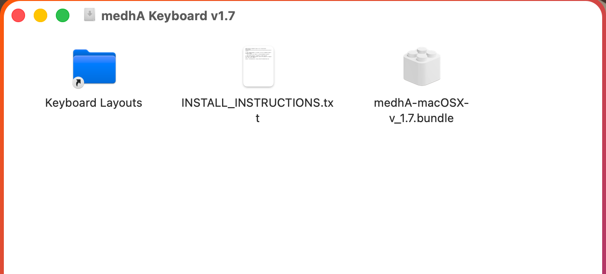
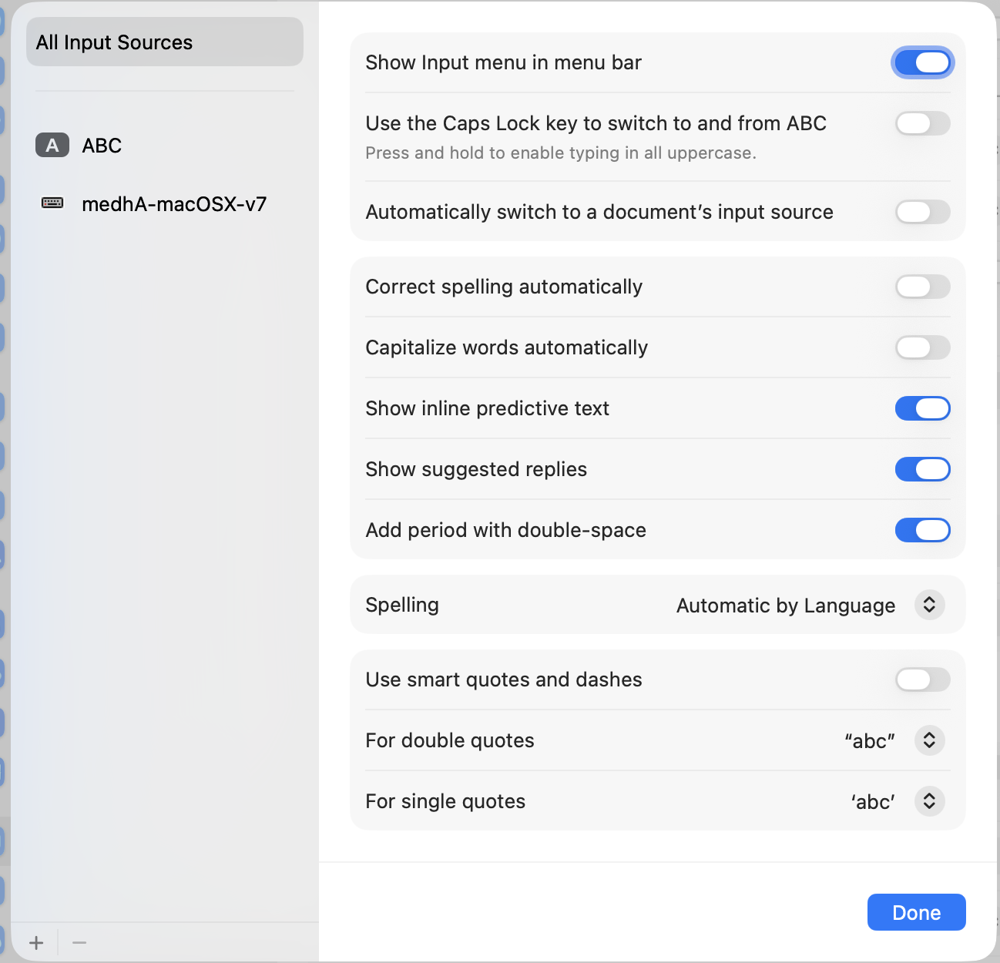
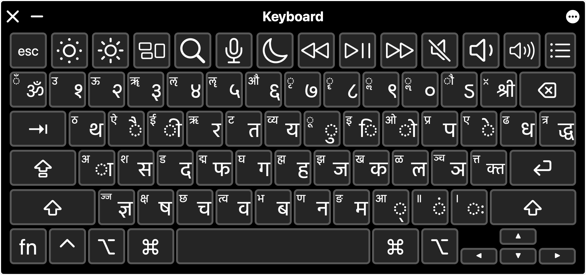
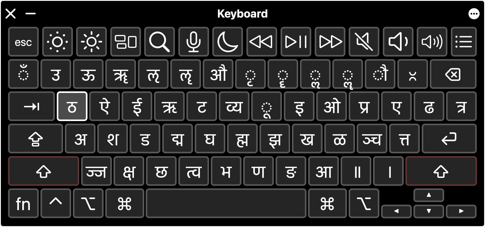
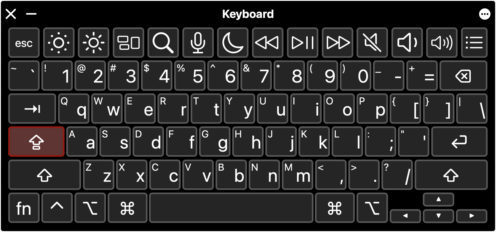
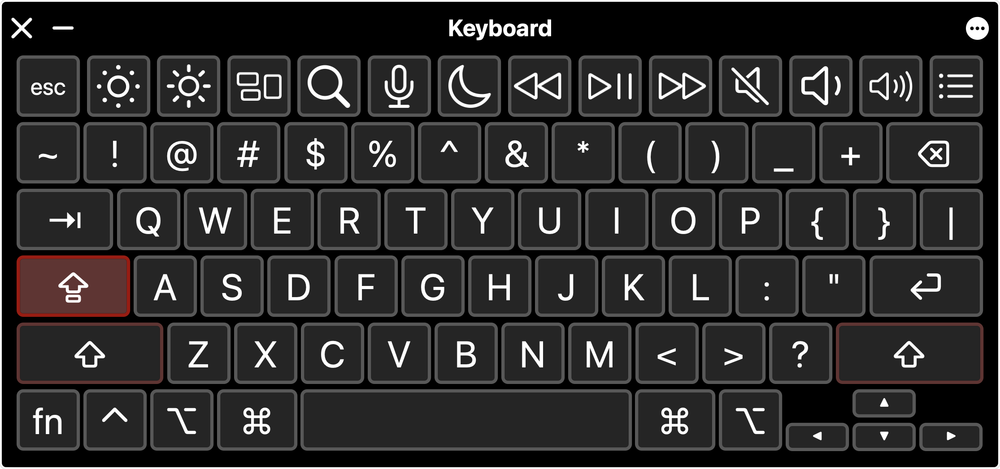

# medhA Keyboard Layout for macOS (Version 1.7 Update & Setup Guide)

**Author**: `lalitaalaalitah`  
**Website**: [https://www.lalitaalaalitah.com](https://www.lalitaalaalitah.com)  
**Original Article**: [https://eng.lalitaalaalitah.com/medha-mac-os/](https://eng.lalitaalaalitah.com/medha-mac-os/)  
**Published on**: [code.lalitaalaalitah.com](https://code.lalitaalaalitah.com)  
**GitHub Repository**: [github.com/lalitaalaalitah/medhA-keyboard_layout](https://github.com/lalitaalaalitah/medhA-keyboard_layout)  

---

## Introduction & Design Scheme

The **`medhA` keyboard layout for macOS** brings the trusted Devanagari typing scheme from Windows and Linux to Apple Mac computers. If you are switching to macOS, `medhA` ensures you feel right at home with identical sound-based key placements for Sanskrit, Hindi, Marathi, Nepali, and other Devanagari-script languages.

---

## 1. Installation Methods on macOS

### Method A: Drag-and-Drop Installation via DMG (Recommended)

1. Download **`medhA-keyboard-macOS-v1.7.dmg`** from the [GitHub Releases](https://github.com/lalitaalaalitah/medhA-keyboard_layout/releases).
2. Double-click the downloaded `.dmg` file to mount it.
3. Simply **drag the `medhA-macOSX-v_1.7.bundle`** file into the **`Keyboard Layouts`** shortcut folder.



---

### Method B: Manual Bundle Copying in Finder

1. Download `medhA-macOSX-v_1.7.bundle`.
2. Open **Finder**, press **`Command + Shift + G`** (Go to Folder).
3. Type **`~/Library/Keyboard Layouts`** (for current user) or **`/Library/Keyboard Layouts`** (for all users) and press **Enter**.
4. Paste `medhA-macOSX-v_1.7.bundle` inside the folder.

---

### Method C: Homebrew Cask

Install directly via terminal using Homebrew:

```bash
brew install lalitaalaalitah/tap/medha-keyboard
```

---

### Method D: Declarative Nix Setup (`nix-darwin`)

For users managing macOS via `nix-darwin`:

```nix
# In your flake.nix inputs:
inputs.medhA-keyboard.url = "github:lalitaalaalitah/medhA-keyboard_layout";

# In system packages:
environment.systemPackages = [ inputs.medhA-keyboard.packages.aarch64-darwin.default ];
```

---

## 2. Activating the Keyboard in System Settings

1. Open **System Settings** (or **System Preferences** on macOS Monterey and earlier) -> **Keyboard** -> **Input Sources**.
2. Click **+** (Add Input Source).
3. Search for **`Sanskrit`** or **`English (US)`**.
4. Select **`medhA-macOSX-v7`** (or `medhA`) and click **Add**.
5. Switch between keyboard layouts using **`Control + Space`** or the Globe key.



---

## 3. Official Visual Layout Maps

Here are the official keymap layer images captured directly from macOS Keyboard Viewer for version 1.7:

### 3.1 Normal / Unshifted State
Default key placements for matras, primary consonants, anusvara, and visarga.



---

### 3.2 Shift State
Holding **`Shift`** accesses full vowels (अ, आ, इ, ई, उ, ऊ, ऋ, ॠ), aspirated consonants (ख, घ, छ, झ, ठ, ढ, थ, ध, फ, भ), and double danda (॥).



---

### 3.3 Caps Lock State
Turning on **`CapsLock`** locks the layout into uppercase / Shifted Devanagari mappings for continuous typing.



---

### 3.4 Caps Lock + Shift State
Combining **`CapsLock + Shift`** dynamically inverts the state back to unshifted matras and consonants.



---

## 4. Quick Typing Formatting Reference

| Action | Key Combination | Output Result |
| :--- | :--- | :--- |
| **Virama / Halanta** | `,` (comma) | **्** (e.g. `k` + `,` + `t` -> **क्त**) |
| **Anusvara** | `.` (period) | **ं** |
| **Visarga** | `/` (slash) | **ः** |
| **Single Danda** | `Shift + /` | **।** |
| **Double Danda** | `Shift + .` | **॥** |

---

## 5. What's Next for Version 8.0.0

In current macOS v1.7, the **`Option (⌥)`** key layer is unmapped, whereas Linux `sa` uses AltGr for Vedic accents (`U+0951`, `U+0952`, `U+1CDA`). The upcoming **Version 8.0.0** release will align the `Option` key on macOS to output Vedic accents, achieving 100% parity across macOS, Linux, and Windows!
